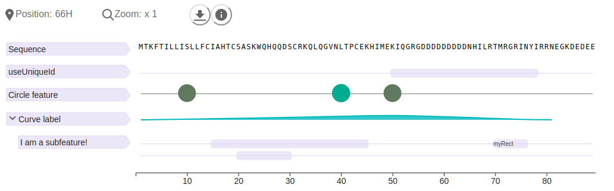

# ngx Feature Viewer

This is a code repository for the Ngx Feature Viewer project.
Represent biological data with the feature viewer library!

Documentation and examples at: 
* http://protein.bio.unipd.it/feature-viewer
* http://calipho-sib.github.io/feature-viewer/examples/

The Feature-Viewer was published as:

| [The Feature-Viewer: a visualization tool for positional annotations on a sequence](https://academic.oup.com/bioinformatics/article/36/10/3244/5716324) |
| -------------  |
| L. Paladin, M. Schaeffer *et al.*, Bioinformatics 2020 |

This project is based on:
* The TypeScript Feature Viewer [feature-viewer-typescript](https://github.com/BioComputingUP/feature-viewer-typescript) 
* The Javascript version [calipho-sib/feature-viewer](https://github.com/calipho-sib/feature-viewer), 
Copyright (c) 2015, SIB Swiss Institute of Bioinformatics. 

<strong>This project is fully compatible with Angular 11.</strong>

## Dependencies

* [Typescript](https://www.typescriptlang.org/) 
* [D3](https://d3js.org/)
* [html-to-image](https://www.npmjs.com/package/html-to-image)

## Peer dependencies
* [@angular/common](https://www.npmjs.com/package/@angular/common)
* [@angular/core](https://www.npmjs.com/package/@angular/core)

## Getting started

1 Install the library using npm
```
npm install ngx-feature-viewer
```

2 Import the feature viewer in javascript or your angular component
```typescript
import {FeatureViewer} from 'ngx-feature-viewer/lib';
```

3 You need to load the feature viewer stylesheet in your angular.json "styles" to 
ensure the correct prioritization of stylesheets.
```json
styles: [
    "./node_modules/ngx-feature-viewer/assets/fv.scss"
]
```

4 Place the feature viewer in your html
```html
<div id="ngxfv"></div>
```

5 Create an instance of the feature viewer in javascript and style it
```typescript
const proteinsequence = 'MTKFTILLISLLFCIAHTCSASKWQHQQDSCRKQLQGVNLTPCEKHIMEKIQGRGDDDDDDDDDNHILRTMRGRINYIRRNEGKDEDEE'
const fv = new FeatureViewer(proteinsequence, '#myfv', {
               showAxis: true,
               showSequence: true,
               toolbar: true,
               toolbarPosition: 'left',
               zoomMax: 10,
               flagColor: '#DFD5F5'
           });
```

6 Add features and subfeatures
```typescript
fv.addFeatures(
      [
        { // simple rect
          type: 'rect',
          id: 'useUniqueId',
          data: [ {
            x: 50, y: 78,
            tooltip: '<button class="myButton">Button</button>'} ],
        },
        { // circles
          type: 'circle',
          id: 'mycircle',
          label: 'Circle feature',
          data: [{x: 10 , y: 100}, {x: 50, y: 70}, {x: 40, y: 60, color: '#00ac8f', tooltip: 'I have different color'}],
          color: '#61795e'
        },
        { // curve (height and yLim) with tooltip and subfeatures
          type: 'curve',
          id: 'mycurve',
          label: 'Curve label',
          data: [{x: 1, y: 0}, {x: 40, y: 102}, {x: 80, y: 5}, {x: 50, y: 184}, {x: 75, y: 4}],
          height: 1,
          yLim: 200,
          color: '#00babd',
          tooltip: '<b>Very</b> <span style="color: #C21F39">Stylable</span> <b><i><span style="color: #ffc520">Tooltip </span></i></b>',
          subfeatures: [
            {
              type: 'rect',
              data: [
                {x: 20, y: 30},
                {x: 15, y: 45},
                {x: 70, y: 76, label: 'myRect', tooltip: 'myTooltip'}
              ],
              id: 'aDifferentId',
              label: 'I am a subfeature!'
            }
          ]
        }
      ]
    )
```

7 Output



## Support
If you have any problem or suggestion please open an issue.

## Release and publish
This application is regularly published as a package in the NPM registry.

## License

This repo is based on:
* The TypeScript Feature Viewer [feature-viewer-typescript](https://github.com/BioComputingUP/feature-viewer-typescript)
* [calipho-sib/feature-viewer](https://github.com/calipho-sib/feature-viewer), Copyright (c) 2015, SIB Swiss 
Institute of Bioinformatics.

This program is free software; you can redistribute it and/or modify it under the terms of the GNU General Public 
License as published by the Free Software Foundation; either version 2 of the License, or (at your option) any later 
version.
